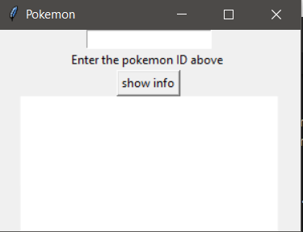
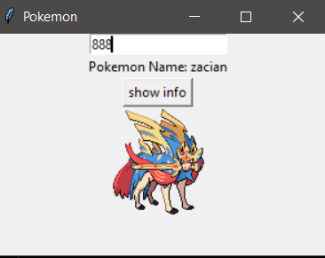

# PokeAPI

## a  simple python script that queries through the pokemon API and gets the name and the image 


  ```txt                             .___.__
  ____   __  __ _  ____     __   ____  __  
(  _ \ /  \(  / )(  __)   / _\ (  _ \(  ) 
 ) __/(  O ))  (  ) _)   /    \ ) __/ )(  
(__)   \__/(__\_)(____)  \_/\_/(__)  (__) 

```
## Dependencies (Modules)

- Python3
- urllib.request
- urllib.request.urlopen
- json

## spin up
- Install Python
- if your using python2 you have to pip install urllib.request and json

```bash
pip install urllib.request
```
```bash
pip install json
```


## screenshots


